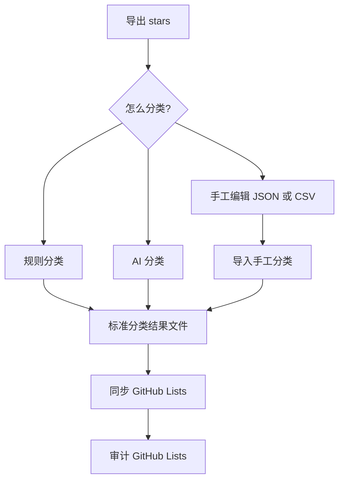

# GitHub Stars 工具

这是一个可移植的 GitHub Stars 整理工具，目标是在任意新机器、新目录下完成：

1. 导出 stars
2. 分类仓库
3. 同步 GitHub Lists
4. 审计最终结果

它正式支持三种分类方式：

1. 本地规则分类
2. 接入 OpenAI-compatible API 的 AI 分类
3. 手工编辑 JSON/CSV 后导入分类

## 能做什么

- 用 GitHub GraphQL 导出 stars
- 在没有 token 时，用已登录浏览器兜底导出
- 统一产出 `json / csv / md` 三种分类文件
- 导入你自己手工维护的分类文件
- 通过浏览器自动化创建并同步 GitHub Lists
- 审计 GitHub 上的 Lists 是否和分类文件一致

## 5 分钟上手

在一台全新的 Windows 机器上，最短路径是：

1. 安装 `Python 3.11+`
2. 安装 `Node.js 20+`
3. 克隆这个仓库
4. 复制 `.env.example` 为 `.env`
5. 如果你想走推荐路径，先填好 `GITHUB_TOKEN`
6. 运行：

```powershell
.\scripts\bootstrap.ps1
.\scripts\menu.ps1
```

第一次最简单的完整流程，直接按这个顺序选：

1. `Export stars (API)`
2. `Classify stars (Rules)`
3. `Sync GitHub Lists`
4. `Audit GitHub Lists`

## 流程图



## 快速开始

1. 安装 `Python 3.11+` 和 `Node.js 20+`
2. 复制 `.env.example` 为 `.env`
3. 检查 `config/config.example.yaml`
4. 执行初始化：

```powershell
.\scripts\bootstrap.ps1
```

5. 运行交互菜单：

```powershell
.\scripts\menu.ps1
```

如果你更喜欢命令行，推荐统一入口：

```powershell
python -m github_stars_tool.cli --config .\config\config.example.yaml <command>
```

## 推荐使用流程

### 路线 A：API 导出 + 规则分类

```powershell
python -m github_stars_tool.cli --config .\config\config.example.yaml export --mode api
python -m github_stars_tool.cli --config .\config\config.example.yaml classify --mode rules
python -m github_stars_tool.cli --config .\config\config.example.yaml sync-lists
python -m github_stars_tool.cli --config .\config\config.example.yaml audit-lists
```

### 路线 B：API 导出 + AI 分类

```powershell
python -m github_stars_tool.cli --config .\config\config.example.yaml export --mode api
python -m github_stars_tool.cli --config .\config\config.example.yaml classify --mode ai
```

然后先检查生成的分类结果，再决定是否执行同步。

### 路线 C：API 导出 + 手工分类

1. 先导出 stars
2. 复制并编辑下面任一模板：
   - `examples/manual/classification.manual.example.json`
   - `examples/manual/classification.manual.example.csv`
3. 导入你编辑后的文件：

```powershell
python -m github_stars_tool.cli --config .\config\config.example.yaml import-classification --input .\your_manual_file.json
```

导入时会做这些事情：

- 校验文件结构
- 自动根据 `full_name` 补全缺失的 GitHub URL
- 重新生成标准的 `json / csv / md` 输出
- 如果同一个仓库重复出现，会直接报错停止

## 手工分类文件格式

每个仓库至少要有两个字段：

- `category`
- `full_name`，格式必须是 `owner/repo`

可选字段：

- `url`
- `language`
- `stars`
- `topics`
- `description`
- `reason`
- `list_description`

JSON 支持两种顶层格式：

- 一个包含 `repositories` 的对象
- 或者直接就是仓库数组

CSV 至少要有两列：

- `category`
- `full_name`

## GitHub Token 说明

程序读取环境变量 `GITHUB_TOKEN`。

推荐使用：

- classic PAT
- 或者能读取当前账号 starred repositories 的 fine-grained token

代码不会写死 token 属于 classic 还是 fine-grained，只会验证它能不能真的访问 GitHub API。

## AI 配置说明

AI 分类按 OpenAI-compatible 接口设计，可配置项包括：

- `llm.provider`
- `llm.base_url`
- `llm.endpoint`
  - `chat_completions`
  - `responses`
- `llm.model`
- `llm.structured_output`
  - `json_object`
  - `off`
- `llm.temperature`

默认建议：

- `endpoint: chat_completions`
- `structured_output: json_object`

如果你配置的中转站或服务商返回的是 Cloudflare 之类的 HTML 挑战页，当前版本会明确提示这是上游防护拦截，而不是给一个难排查的 JSON 解析错误。

## GitHub Lists 的现实限制

GitHub 公开 API 能稳定处理 stars，但没有稳定公开的 Lists 管理接口。  
所以项目的设计是：

- `export` 优先走 API
- `sync-lists / audit-lists` 走浏览器自动化

## 常见问题

### `export --mode api` 失败

优先检查：

- `GITHUB_TOKEN` 是否已设置
- 这个 token 是否能读取 starred repositories
- token 对应的是不是你期望的 GitHub 账号

### `export --mode browser` 或 `sync-lists` 失败

优先检查：

- Chrome 是否已经登录 GitHub
- Chrome 是否使用了 `9222` 调试端口启动
- 当前 GitHub 页面有没有停在登录或验证页面

启动示例：

```powershell
& 'C:\Program Files\Google\Chrome\Application\chrome.exe' `
  --remote-debugging-port=9222 `
  --user-data-dir="$env:LOCALAPPDATA\Google\Chrome\User Data" `
  --profile-directory=Default `
  https://github.com
```

### AI 分类返回 HTTP 403 或 HTML

这通常不是请求体格式问题，而是上游服务返回了 Cloudflare 或其他反爬挑战页。可以优先尝试：

- 换成更直连的 API 地址
- 优先试 `chat_completions`
- 确认你的服务商真的兼容 OpenAI 格式

### 手工分类导入失败

优先检查：

- 每个仓库是否都有 `category`
- 每个仓库是否都有 `full_name`
- `full_name` 是否是 `owner/repo`
- 同一个仓库是否重复出现

## 目录结构

- `config/`：配置模板
- `examples/manual/`：手工分类模板
- `src/github_stars_tool/`：Python CLI
- `data/raw/`：导出的 stars 原始数据
- `data/normalized/`：标准化数据
- `data/classification/`：分类结果
- `data/audit/`：同步状态和审计报告
- `scripts/`：初始化、菜单和快捷脚本

## 注意事项

- `sync-lists` 和 `audit-lists` 不要并行运行
- `audit-lists` 应该在 `sync-lists` 完成后再跑
- 如果 `github.user` 留空，同步脚本会自动读取当前浏览器已登录的 GitHub 账号
- `data/` 下的运行产物已经加入 `.gitignore`，方便把仓库公开分享出去
